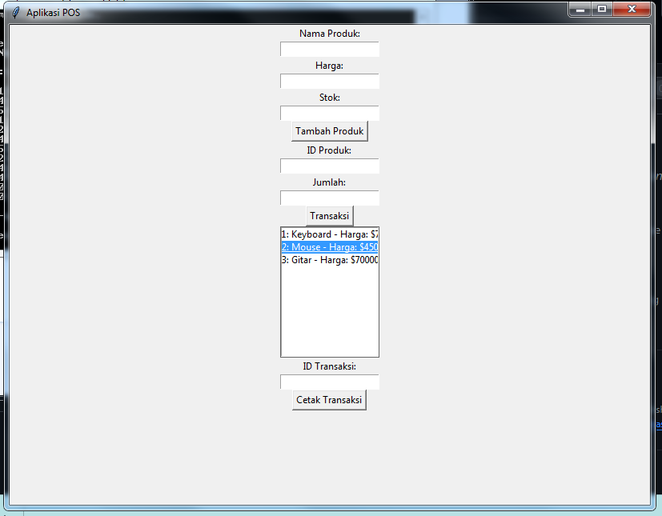

# Aplikasi Point of Sale (POS) dengan Python dan MySQL

Aplikasi Point of Sale (POS) sederhana dengan antarmuka grafis (GUI) yang dibangun menggunakan Python dan MySQL. Aplikasi ini memungkinkan Anda untuk mengelola produk, melakukan transaksi, mencetak struk transaksi dalam dokumen PDF, dan melihat daftar produk.



## Fitur Aplikasi

- Menambahkan produk ke dalam database.
- Melakukan transaksi dengan produk yang ada di dalam database.
- Mencetak struk transaksi dalam dokumen PDF.
- Melihat daftar produk yang tersedia.

## Instalasi

1. Pastikan Anda telah menginstal Python dan modul-modul yang diperlukan, seperti `mysql-connector-python` dan `reportlab`. Anda dapat menginstalnya dengan perintah berikut:

   ```
   pip install mysql-connector-python
   pip install reportlab
   ```

2. Buat database MySQL dan tabel-tabel yang diperlukan. Anda dapat mengikuti instruksi pada bagian "Membuat Database dan Tabel" pada kode program.
```
CREATE DATABASE posdb;
USE posdb;

CREATE TABLE products (
    product_id INT AUTO_INCREMENT PRIMARY KEY,
    product_name VARCHAR(255),
    price DECIMAL(10, 2),
    stock INT
);

CREATE TABLE transactions (
    transaction_id INT AUTO_INCREMENT PRIMARY KEY,
    product_id INT,
    quantity INT,
    total_amount DECIMAL(10, 2)
);
```
3. Jalankan aplikasi POS:

   ```
   python app.py
   ```

## Penggunaan

1. Tambahkan produk ke dalam database dengan mengisi nama produk, harga, dan stok, lalu klik "Tambah Produk."

2. Lakukan transaksi dengan memasukkan ID produk dan jumlah yang dibeli, lalu klik "Transaksi."

3. Untuk mencetak struk transaksi, masukkan ID transaksi dan klik "Cetak Transaksi."

4. Anda dapat melihat daftar produk yang tersedia di daftar produk.

## Kontribusi

Kontribusi dan saran sangat dihargai. Jika Anda ingin berkontribusi ke proyek ini, ikuti langkah-langkah berikut:

1. Fork repositori ini.

2. Buat branch fitur Anda: `git checkout -b fitur-anda`.

3. Komit perubahan Anda: `git commit -m 'Menambahkan fitur yang keren'`.

4. Push ke branch Anda: `git push origin fitur-anda`.

5. Buat pull request.

## Lisensi

Proyek ini dilisensikan di bawah Lisensi MIT - lihat berkas [LICENSE](LICENSE) untuk detail lebih lanjut.

---

Terima kasih telah menggunakan Aplikasi POS ini! Jika Anda memiliki pertanyaan atau masalah, jangan ragu untuk menghubungi kami.

[Email Kami](mailto:fajarjulyana1@gmail.com)
